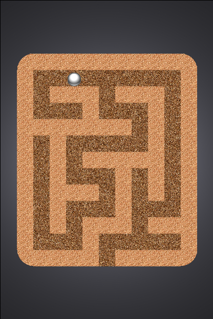

Hidden Marble
=============

An Android game built using libgdx and Box2D. The objective is to get the
marble out of the box. Of course, there is a catch--hidden inside the box is a
maze.

[Amazon Appstore Link](http://www.amazon.com/js42721-Hidden-Marble/dp/B00OXDX214/)

The code for this game follows the Model-View-Controller (MVC) pattern:

* The physics engine (the model) defines the behavior of game objects and
keeps track of their states.
* The rendering code (the view) gets information from the physics engine so it
can draw objects in the right place and play the appropriate sounds.
* The UI code (the controller) processes input in the form of accelerometer
readings and tells the physics engine to update itself according to the input.

This structure makes things like fine-tuning the physics or customizing the
appearance straightforward since you don't have to worry about breaking
something else in the process.
